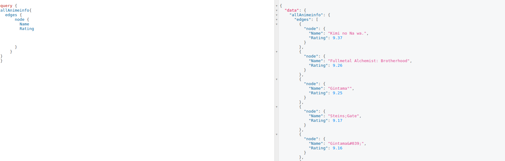

# Anime-API

This is free API for all the Otakus out there. The tech stack used are Django, Graphql, supported by Graphene-Django.
There are few useful filters eg: you can filter by the Rating or the Genre etc. This project could we extended for other apps if need be.

## How to build 

- First of all clone the repo

```console

$ git clone https://github.com/ananthanandanan/Anime-API

```
- Setup a virtual environment using pip virtualenv or conda 

- cd into the  project at same level as manage.py

```console

$ pip install -r requirements.txt

```

```console

$ python manage.py runserver

```
## Screen_shot
The dataset used for this API is from [kaggle](https://www.kaggle.com/CooperUnion/anime-recommendations-database?select=anime.csv)



Enjoy! :smile:

